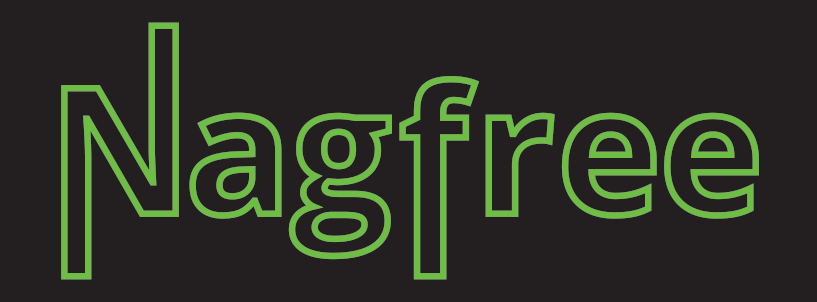

A Chrome extension that makes a few sites a little better

NagFree is a Chrome extension that takes away the usability problems some sites have. Flickr and Instagram, for example, don't allow you to right-click on photographs to save them. This extension fixes that. The search results page on Wikimedia Commons is pretty awful, so this extension fixes that.

## Installing
1. Either [download this extension](https://github.com/hay/nagfree/releases/latest/download/package.zip) and unzip the file or use `git clone` to clone the repo.
2. Go to your <a href="chrome://extensions/">Chrome extensions</a>
3. Enable 'Developer mode' (switch on the right)
4. Click the 'Load unpacked' button on the top left and select the directory
5. Go to [whitehouse.gov](https://www.whitehouse.gov/). If the font is set to Comic Sans, the extension is running!

## Current scripts
* `ah` - Add price per kilogram to product listings on ah.nl
* `aliexpress` - Add an option to filter by a minimum amount of ratings
* `beeldbank` - Get bigger thumbnails
* `bloomberg` - Remove paywall banner
* `booking` - Remove silly stress inducing UX from booking.com
* `drukwerkdeal` - Add price per piece
* `eyefilm` - Remove fixed header
* `facebook` - Remove useless right column
* `filmladder` - Add option to see times with movie listings
* `flickr` - Remove Spaceball to allow right-click to download photos from the 'all sizes' download page
* `ftm` - Remove paywall
* `funda` - Add price per square meter
* `google` - Remove cruft and useless ads
* `groene` - Add word count / reading time
* `indebuurt` - Remove those stupid arrows floating over the text
* `instagram` - Allow right-clicking on and saving images
* `medium` - Remove nonsense
* `metafilter` - Add a 'sort by favorites' option to questions
* `newyorker-nonag` - No nagscreen
* `newyorker-readtime` - Add reading time / wordcount
* `npo-cookies` - Automatically deny all tracking and social media NPO cookies
* `nytimes` - Remove anti-adblocker messages
* `oddschecker` - Add more sane numbers
* `pinterest` - Remove the ugly giftwrap thing
* `revue` - Remove sources holder
* `slate` - Add some sane line length on paragraphs
* `spotify-open-in-app` - Open open.spotify.com links in the desktop app instead of with the web client
* `twitter` - Hide retweets, 'liked by', promoted tweets and other crap
* `volkskrant-readtime` - Adding reading time / word count
* `volkskrant-static-header` - Make fixed header not fixed
* `vox` - Remove the tab bar
* `whitehouse` - Set font to Comic Sans
* `wikimedia-commons` - Add a better search results page to Wikimedia Commons
* `wikipedia-geolink` - Directly link the coordinates in articles to Google Maps instead of the geohack tool
* `wikipedia-pageviews` - Add a link to pageviews to every Wikipedia article
* `wikipedia-wikidataid` - Add Wikidata ID to all Wikipedia articles
* `wired` - Remove paywall / anti adblock thing